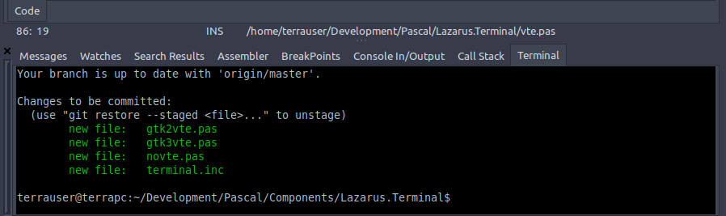

# Lazarus Terminal



This package adds gnome terminal component and plugin to the Lazarus IDE. It requires the gtk2 widgetset and the vte Linux package.

```bash
 sudo apt install libvte9
```

To the terminal inside the IDE install the design time package and select Terminal from the View menu.

## Recent changes

* Added custom colors
* Added custom fonts
